# 📈 Sales Forecasting System

## Overview

This project develops an end-to-end Sales Forecasting System using Time Series Analysis, Statistical Forecasting, Deep Learning, and Business Intelligence.

The objective is to forecast future retail sales and compare multiple forecasting approaches:

- ARIMA
- Prophet
- LSTM Neural Network

The final model is selected using MAE and RMSE evaluation metrics.

---

## Dataset

**Dataset:** Walmart Weekly Sales Dataset

The dataset contains historical weekly retail sales data used for forecasting future demand.

### Business Objective

Retail organizations require accurate demand forecasting to:

- Optimize inventory management
- Reduce stock shortages and overstocking
- Improve revenue planning
- Support data-driven business decisions

This project addresses these challenges by building and comparing multiple forecasting models.

---

## Technologies Used

### Data Analysis

- Python
- Pandas
- NumPy

### Visualization

- Matplotlib
- Seaborn
- Plotly

### Forecasting

- Statsmodels (ARIMA)
- Prophet
- TensorFlow / Keras (LSTM)

### Business Intelligence

- Power BI

---

# Project Workflow

1. Data Cleaning
2. Exploratory Data Analysis
3. Weekly Sales Aggregation
4. Stationarity Testing
5. ACF & PACF Analysis
6. ARIMA Forecasting
7. Prophet Forecasting
8. LSTM Forecasting
9. Model Evaluation
10. Dashboard Development

---

# Model Performance

| Model | MAE | RMSE |
|---------|---------:|---------:|
| ARIMA | 6,910,390 | 7,567,086 |
| Prophet | 6,901,726 | 8,335,014 |
| LSTM | 6,510,116 | 6,849,696 |

---

# Best Model

🏆 **LSTM Neural Network**

The LSTM model achieved the lowest MAE and RMSE values and was selected as the final forecasting model.

---

# 📊 Power BI Dashboard

## Final Dashboard

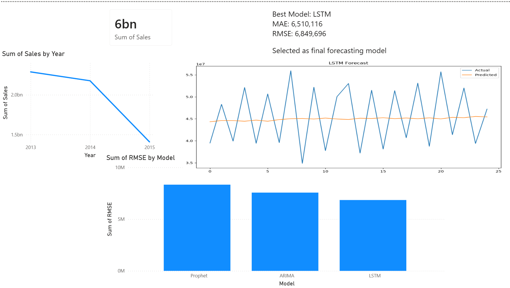

### Dashboard Features

- Total Sales KPI
- Average Sales KPI
- Sales Trend Analysis
- RMSE Model Comparison
- Forecast Visualization
- Best Model Selection Summary
- Date Slicer for Interactive Filtering
- Forecast vs Last Quarter KPI
- Model Performance Distribution

---

# 📈 Exploratory Data Analysis

## Weekly Sales Trend

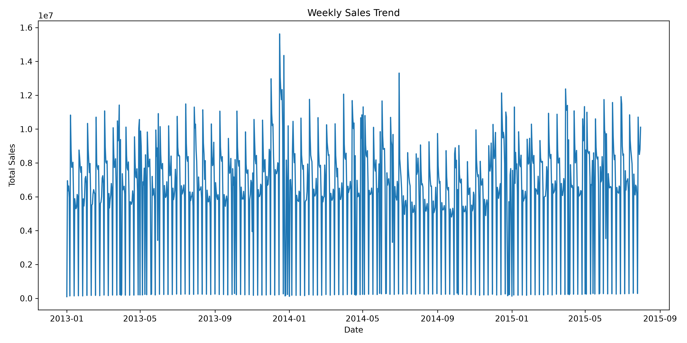

---

## Overall Sales Trend

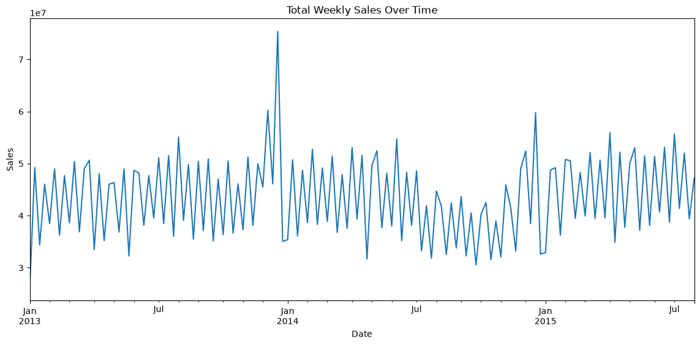

---

## Sales by Day of Week

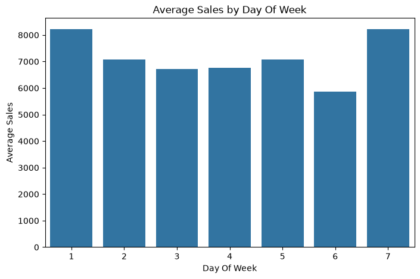

---

## Top 10 Stores by Revenue

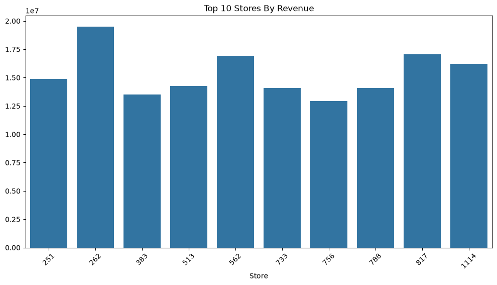

---

## Promotional vs Non-Promotional Sales

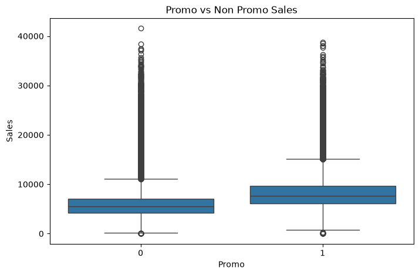

---

## STL Decomposition

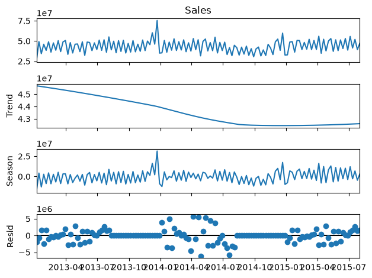

---

# 📉 Stationarity Analysis

Time series forecasting requires stationarity. The following analyses were performed to understand trend, seasonality, and autocorrelation patterns.

## ADF Test

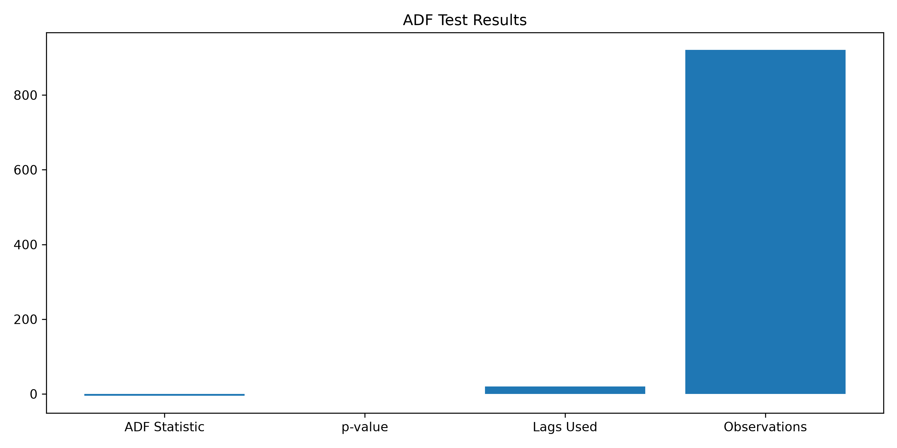

---

## ACF Plot

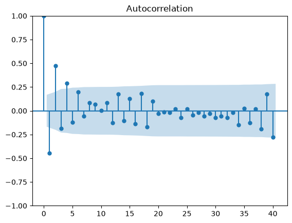

---

## PACF Plot

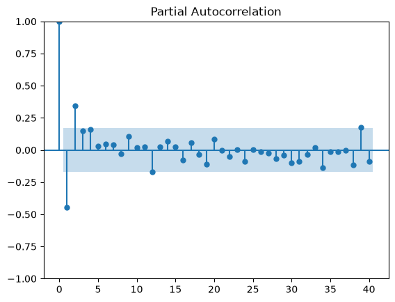

---

# 🤖 ARIMA Forecasting

ARIMA was implemented as a classical statistical forecasting baseline.

## ARIMA Forecast

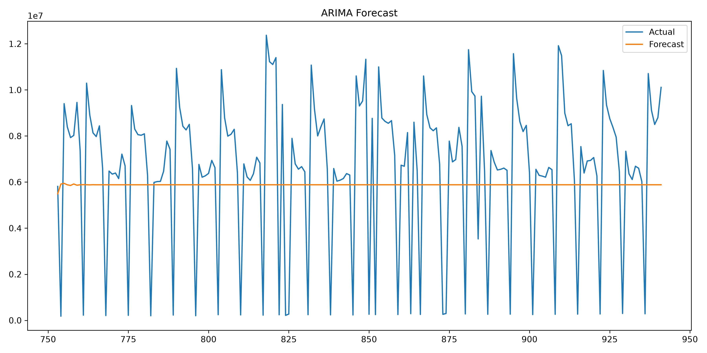

---

## ARIMA Actual vs Predicted

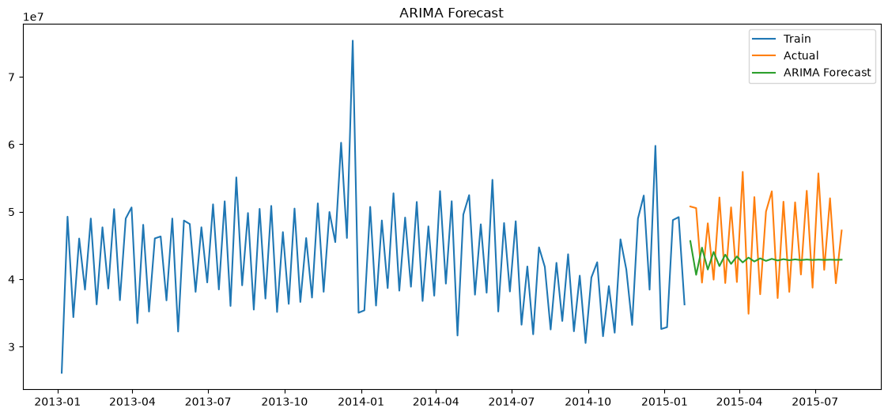

---

# 🔮 Prophet Forecasting

Facebook Prophet was used to capture trend and seasonality automatically.

## Prophet Forecast

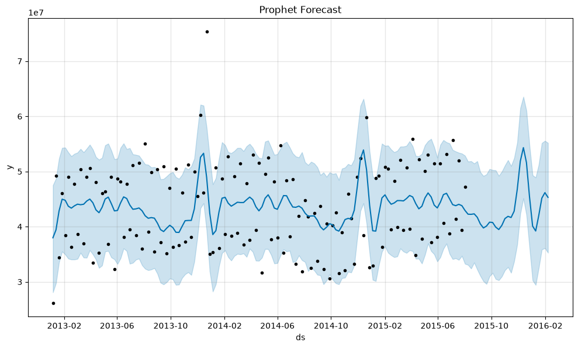

---

## Prophet Components

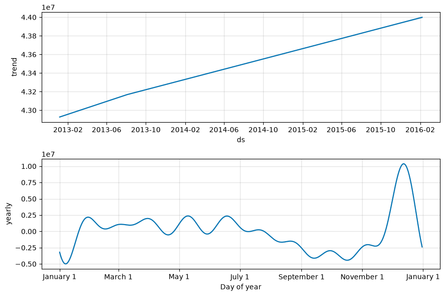

---

# 🧠 LSTM Forecasting

Long Short-Term Memory (LSTM) networks were implemented to learn temporal dependencies from historical sales data.

## LSTM Training Loss Curve

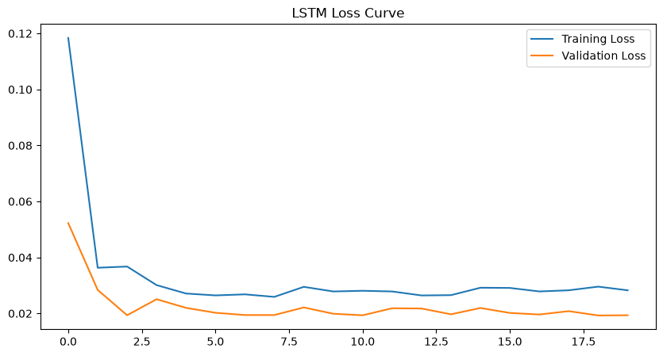

---

## LSTM Actual vs Predicted

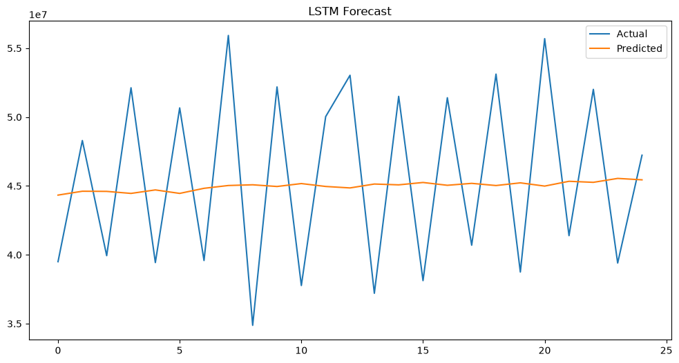

---

# 📋 Model Comparison

## Model Comparison Visualization

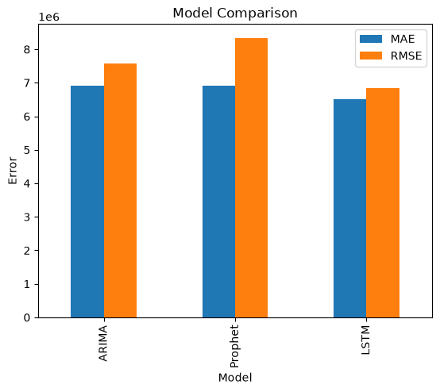

---

# 📌 Key Findings

- Strong seasonality patterns exist within weekly sales.
- Promotional activities significantly influence sales performance.
- Certain stores contribute disproportionately to total revenue.
- Statistical models provide strong baselines but struggle with complex temporal dependencies.
- LSTM effectively captures long-term patterns and nonlinear relationships.
- LSTM achieved the lowest forecasting error among all evaluated models.

---

# 🏆 Final Outcome

The forecasting models were evaluated using:

- MAE (Mean Absolute Error)
- RMSE (Root Mean Squared Error)

Results indicate that:

| Model | MAE | RMSE |
|---------|---------:|---------:|
| ARIMA | 6,910,390 | 7,567,086 |
| Prophet | 6,901,726 | 8,335,014 |
| LSTM | 6,510,116 | 6,849,696 |

🏆 **LSTM achieved the lowest error values and was selected as the final forecasting model.**

---

# Project Structure

```text
sales-forecasting-system/

├── data/
│
├── notebooks/
│   ├── 01_EDA.ipynb
│   └── 02_models.ipynb
│
├── models/
│   ├── arima_model.pkl
│   ├── prophet_model.pkl
│   └── lstm_model.keras
│
├── reports/
│   └── model_comparison.csv
│
├── dashboard/
│   ├── powerbi/
│   │   └── sales_forecasting_dashboard.pbix
│   │
│   └── screenshots/
│       ├── powerbi_dashboard.png
│       ├── weekly_sales_trend.png
│       ├── sales_trend.png
│       ├── sales_by_dayofweek.png
│       ├── top10_stores_revenue.png
│       ├── promo_vs_nonpromo.png
│       ├── stl_decomposition.png
│       ├── adf_test.png
│       ├── acf_plot.png
│       ├── pacf_plot.png
│       ├── arima_forecast.png
│       ├── arima_actual_vs_predicted.png
│       ├── prophet_forecast.png
│       ├── prophet_components.png
│       ├── lstm_loss_curve.png
│       ├── lstm_actual_vs_predicted.png
│       └── model_comparison.png
│
├── README.md
└── requirements.txt
